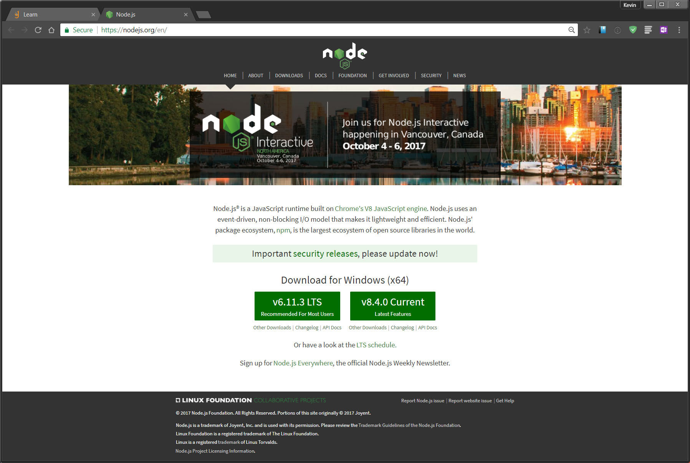

Checkpoint exercise for Galvanize Unit 29: Responsive Design.

Challenge is to recreate node.js homepage (as seen below) using my own grid system and basic CSS.

There should be at least one change to the site based on the screen size getting smaller.

